# Barsum — Process Flow & Architecture

## Что такое Barsum

Образовательная платформа для детей в Казахстане. Дети проходят ежедневные учебные челленджи, зарабатывают монеты и обменивают их на реальные награды от родителей. Эксперты-авторы создают и монетизируют программы развития.

**Стек:** Next.js 16 (App Router) + React 19 · NestJS 11 + TypeScript · PostgreSQL + TypeORM · Minio (аудио) · OpenAI (Whisper + GPT) · mobile-first · валюта — тенге (₸) · курс: 1 ₸ = 10 монет

---

## Четыре роли пользователей

| Роль | Описание | Вход в систему |
|------|----------|----------------|
| `child` | Ребёнок, участник челленджей | Логин + пароль (задаёт родитель) |
| `parent` | Родитель, покупает и контролирует | Email + пароль |
| `expert` | Автор-эксперт, создаёт челленджи | Email + пароль, отдельный онбординг |
| `admin` | Администратор Barsum | Email + пароль, внутренний доступ |

---

## Экраны (view) по ролям

### Роль: child
| view | Название | Описание |
|------|----------|----------|
| `home` | Каталог | Лента доступных челленджей с фильтрацией по категориям |
| `session` | Занятие | Ежедневная сессия — чтение, запись, AI-анализ |
| `shop` | Магазин | Обмен монет на награды + трекер мечты |

### Роль: parent
| view | Название | Описание |
|------|----------|----------|
| `home` | Каталог | Просмотр и покупка челленджей для ребёнка |
| `cabinet` | Кабинет | Дашборд детей, купленные челленджи, очередь проверки |
| `rewards` | Награды | Управление наградами, одобрение запросов |

### Роль: expert
| view | Название | Описание |
|------|----------|----------|
| `ex_home` | Главная эксперта | Метрики, очередь ревью, сообщения |
| `ex_books` | Каталог | Все опубликованные челленджи |
| `create` | Создание | Wizard (4 шага) создания нового челленджа |

### Роль: admin
| view | Название | Описание |
|------|----------|----------|
| `payments` | Оплаты | Очередь чеков Kaspi Pay — подтверждение/отклонение |
| `experts` | Эксперты | Модерация заявок экспертов (new → approved/rejected) |
| `challenges` | Челленджи | Модерация опубликованных челленджей |

---

## Категории контента

> **Скоуп v1:** реализуется только категория `reading`. Остальные категории — следующие версии.

| ID | Название | Цвет | Статус |
|----|----------|------|--------|
| `reading` | Чтение | `#6347E0` (фиолетовый) | ✅ **v1** |
| `logic` | Логика | `#D14E84` (розовый) | ⏳ позже |
| `finance` | Финансы | `#C8861F` (золотой) | ⏳ позже |
| `english` | Английский | `#3470DB` (синий) | ⏳ позже |
| `sport` | Спорт | `#12895F` (зелёный) | ⏳ позже |
| `creativity` | Творчество | `#D2652F` (оранжевый) | ⏳ позже |

---

## Скоуп v1

> Реализуется в первой версии. Всё остальное — следующие итерации.

| Блок | v1 | Позже |
|------|----|-------|
| Категории | Только `reading` (Чтение) | logic, finance, english, sport, creativity |
| Челленджи | Только читательские (книги) | Все остальные типы |
| Ежедневные задачи | Прочитать → Голосовой пересказ → Whisper транскрибация → AI анализ → 3 вопроса AI | Другие форматы заданий |
| Авторизация | Email + пароль (родитель/эксперт), логин + пароль (ребёнок) | OAuth, соцсети |
| Экран ребёнка | Баланс монет + активные челленджи | Полный профиль, ачивки |
| Магазин наград | Базовый список + кнопка «Отправить в мечту» | Расширенный каталог, авто-накопление |
| Dream savings | Ручная кнопка «Отправить в мечту» | Авто 10% (A/B эксперимент) |
| Сертификаты | — | Цифровые сертификаты |
| Эксперт | ✅ Кабинет эксперта + wizard создания (4 шага) | — |
| AI-модерация | ✅ Автоматический зачёт > 80%, ручная проверка < 80% | — |
| Оплата | ✅ Kaspi Pay — ручное подтверждение чека администратором | Прямая API-интеграция Kaspi Pay, TipTop |
| Админ-панель | ✅ Подтверждение чеков, модерация экспертов и челленджей | — |

---

## Навигационная карта

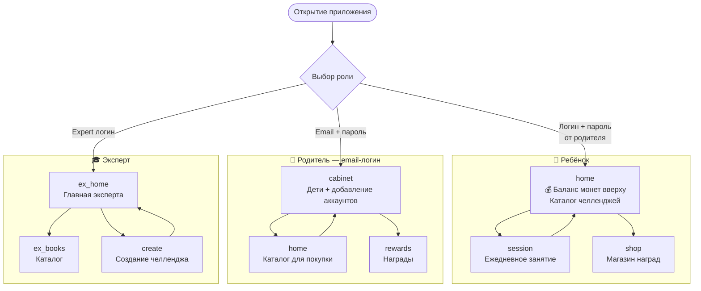

---

## Флоу 1: Регистрация / Вход

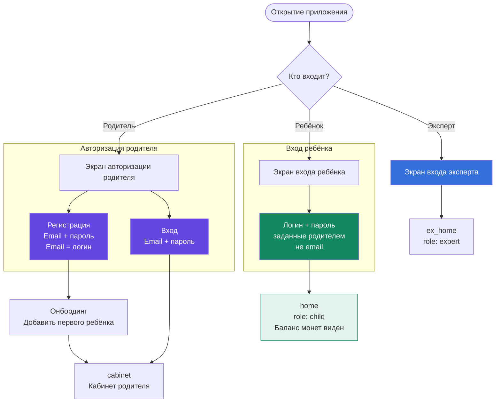

---

## Флоу 1б: Родитель — добавление ребёнка и передача доступа

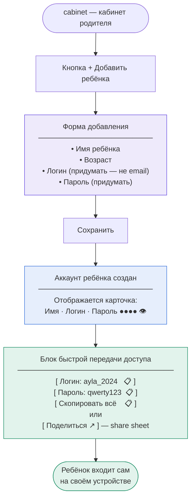

### Правила аккаунта ребёнка

| Поле | Требования |
|------|-----------|
| Логин | Произвольный (не email), уникальный в системе, напр. `ayla_2024` |
| Пароль | Задаёт родитель, ребёнок может сменить позже |
| Привязка | Ребёнок привязан к аккаунту родителя |
| Копирование | Логин и пароль копируются одной кнопкой — для передачи в мессенджер |

---

## Флоу 2: Ребёнок — главный экран и ежедневное занятие

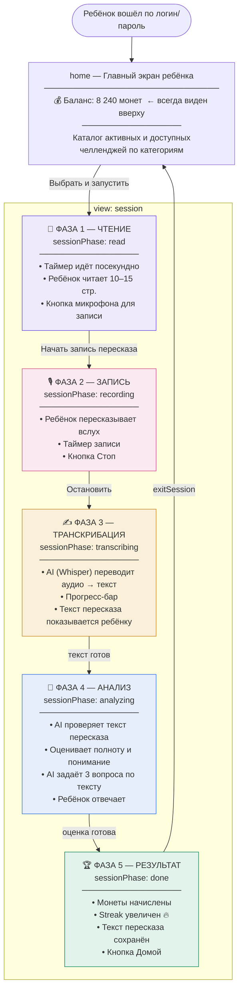

### Детальный флоу AI-обработки (транскрибация + анализ)

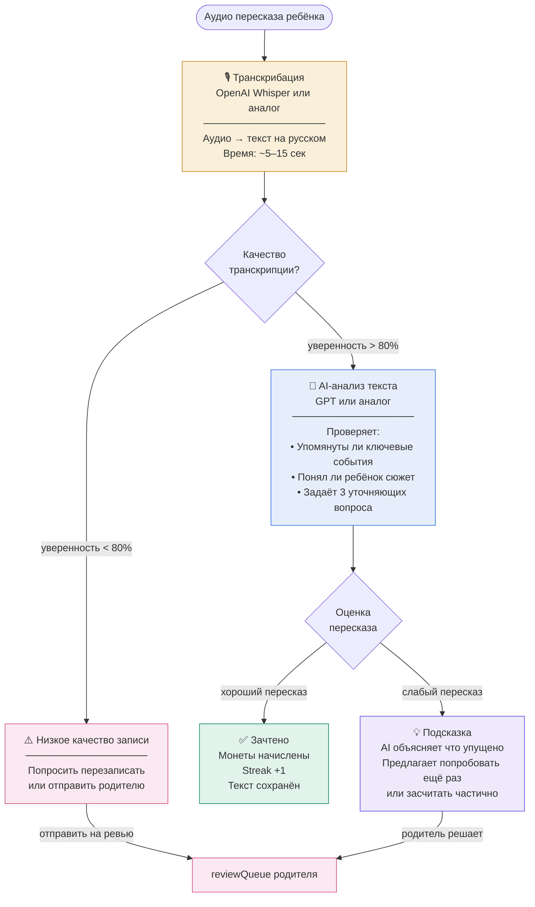

### Ежедневные задачи — v1 (только Чтение)

| Категория | Задача 1 | Задача 2 | Задача 3 | Статус |
|-----------|----------|----------|----------|--------|
| **reading** | Прочитать главу (10–15 стр.) | Ответить на 3 вопроса AI | Голосовой пересказ | ✅ v1 |
| finance | Изучить тему дня | Практическая задача | Записать вывод в дневник | ⏳ позже |
| logic | Решить 3 головоломки | Объяснить ход решения | Пройти мини-тест | ⏳ позже |
| english | Выучить 5 слов | Прочитать текст | Произнести вслух (запись) | ⏳ позже |
| sport | Упражнения дня | Снять короткое видео | Отметить самочувствие | ⏳ позже |
| creativity | Творческое задание | Сфотографировать работу | Описать идею | ⏳ позже |

---

## Флоу 3: Родитель — покупка челленджа

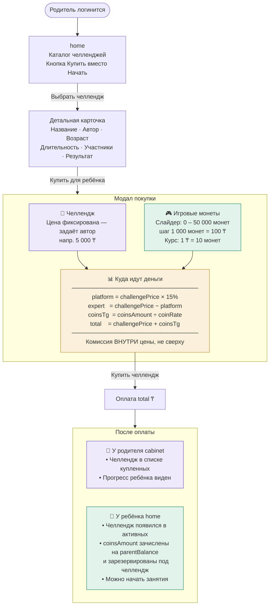

### Формулы расчёта (из спеки)

```js
coinsTg   = coinsAmount / coinRate          // 10000 / 10 = 1 000 ₸
platform  = round(challengePrice × 0.15)   // 5000 × 0.15 = 750 ₸
expert    = challengePrice - platform       // 5000 − 750 = 4 250 ₸
total     = challengePrice + coinsTg        // 5000 + 1000 = 6 000 ₸
```

> **Важно:** комиссия 15% зашита **внутри** цены челленджа — не накручивается сверху.
> Итого = цена челленджа + цена монет, и ничего больше.

### Пример: челлендж «Волшебный мир книг»

| Строка | Сумма |
|--------|-------|
| Челлендж (challengePrice) | 5 000 ₸ |
| → Эксперт (85%) | 4 250 ₸ |
| → Barsum (15%) | 750 ₸ |
| Игровые монеты · 10 000 шт. (coinsTg) | 1 000 ₸ |
| **Итого к оплате** | **6 000 ₸** |

### Payload при нажатии «Купить челлендж»

```js
{
  challengeId,
  challengePrice,  // 5000
  coinsAmount,     // 10000
  coinsPrice,      // 1000
  total,           // 6000
  currency: "KZT",
  authorId,
  commissionPct    // 0.15
}
```

### Входные данные с бэка (конфигурируемые)

| Параметр | Описание | Пример |
|----------|----------|--------|
| `challengePrice` | Цена челленджа в ₸, задаёт автор | 5 000 |
| `coinRate` | Сколько монет за 1 ₸ | 10 |
| `commissionPct` | Комиссия платформы | 0.15 |
| `coinsMin/Max/Step/Default` | Параметры слайдера | 0 / 50 000 / 1 000 / 10 000 |
| `author` | Имя, рейтинг, id, ссылка на профиль | — |

---

## Флоу 4: Магазин наград (Ребёнок)

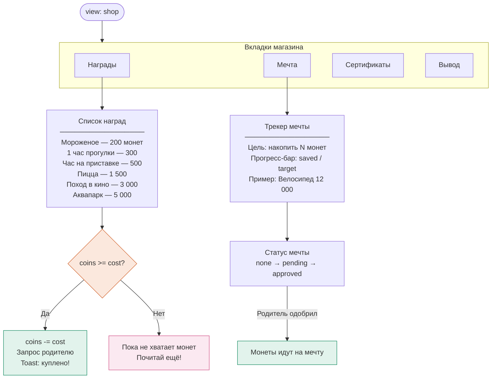

### Очередь наград у Родителя

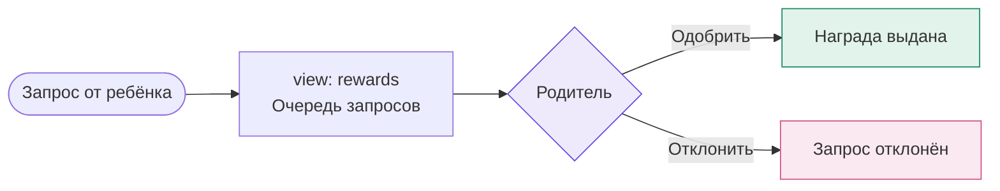

---

## Флоу 5: Эксперт — создание челленджа (Wizard)

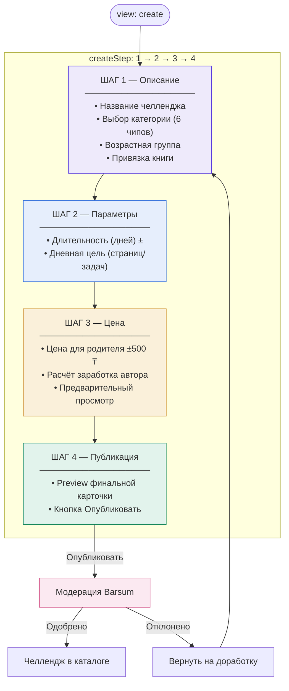

---

## Флоу 6: Эксперт — онбординг

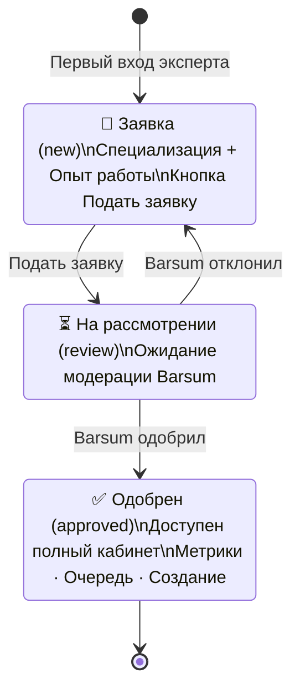

---

## Флоу 7: AI-модерация сессий

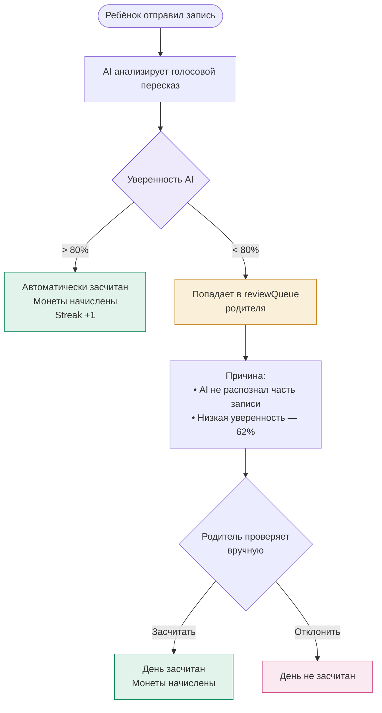

---

## Экономика монет (закрытая валюта)

Монета — **внутренняя закрытая валюта**: не выводится в реальные деньги, не сгорает.
Один и тот же запас монет крутится по кругу между балансом родителя и балансом ребёнка.
Реальные деньги входят в систему только один раз — при покупке монет.

**Курс: 1 ₸ = 10 монет** (не 1:1).

### Два баланса

| Баланс | Описание |
|--------|----------|
| `parentBalance` | Кошелёк родителя в монетах. Пополняется при покупке и при возврате монет от ребёнка. |
| `childBalance` | Кошелёк ребёнка в монетах. Пополняется за выполненные челленджи, тратится в магазине наград. |

### Цикл движения монет

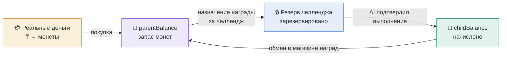

### Таблица транзакций (леджер)

| Событие | Откуда | Куда | Статус |
|---------|--------|------|--------|
| Покупка монет (₸ → монеты) | эмиссия | `parentBalance` | confirmed |
| Запись на челлендж | `parentBalance` | резерв челленджа | reserved |
| Челлендж выполнен, AI подтвердил | резерв челленджа | `childBalance` | confirmed |
| Ребёнок запросил награду | `childBalance` | `rewardPending` | pending |
| Родитель нажал «Награда выдана» | `rewardPending` | `parentBalance` | confirmed |
| Родитель отклонил награду | `rewardPending` | `childBalance` | returned |

> Ключевое: монеты возвращаются родителю **только после нажатия «Награда выдана»** — не сразу при запросе.
> Это замкнутый круг: родитель раздаёт вернувшиеся монеты в следующих челленджах.

### Правила

- Курс ₸ → монеты применяется только при покупке. Возврат в монетах 1:1, без обратной конвертации в ₸.
- Монеты резервируются **сразу** при записи на челлендж. Доступный `parentBalance` уменьшается немедленно.
- Нельзя потратить больше, чем есть на `childBalance`; нельзя записать на челлендж если `parentBalance` < стоимость.
- Автоматическое 10% отчисление в dream-savings **убрано**. Ребёнок вручную нажимает «Отправить в мечту».
- Идемпотентность обязательна — повторный клик или ретрай не должны задвоить операцию.
- История транзакций (леджер) ведётся по всем балансам.

---

## Флоу 8: Оплата через Kaspi Pay (ручное подтверждение)

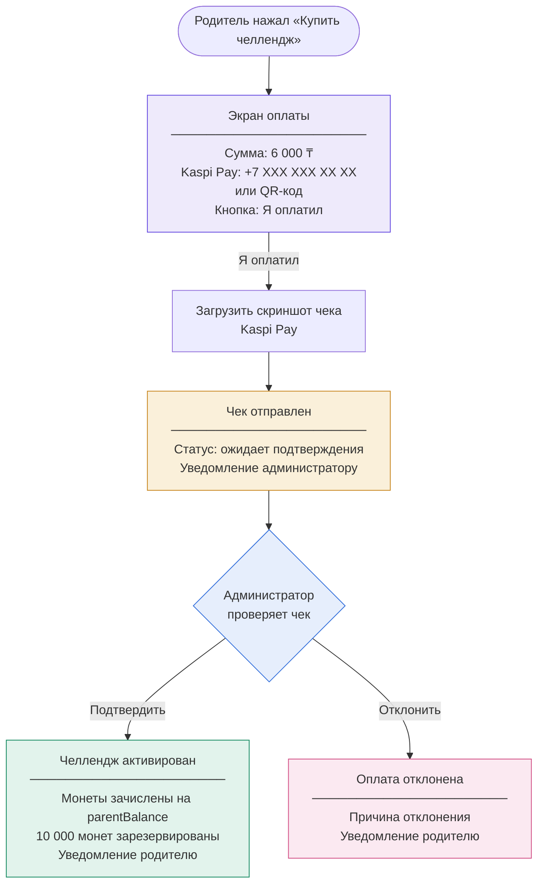

### Статусы платежа

| Статус | Описание |
|--------|----------|
| `pending` | Чек загружен, ожидает проверки |
| `confirmed` | Администратор подтвердил — челлендж активирован |
| `rejected` | Администратор отклонил — родитель получил уведомление |

> В v2 планируется прямая API-интеграция Kaspi Pay и TipTop для автоматического подтверждения.

---

## Структура данных (ключевые объекты)

### Челлендж
```js
{
  title: '30 дней чтения',
  author: 'Даулет Мукаев',
  cat: 'reading',         // категория
  age: '7–12 лет',
  days: '30 дней',
  books: '1 книга',
  members: '1250',        // кол-во участников
  price: '19 900 ₸',      // цена для родителя
  earn: '14 950 ₸',       // заработок автора
  hit: true               // флаг "хит"
}
```

### Ребёнок
```js
{
  id: Date.now(),
  name: 'Айла',
  age: '9 лет',
  cat: 'reading',         // текущая категория
  books: '3',
  pages: '126',
  streak: '14',           // 🔥 серия дней
  earned: '8 240 ₸',
  progress: '64%',
  activeCh: '2'           // активных челленджей
}
```

### Награда
```js
{
  id: 1,
  name: 'Мороженое',
  cost: 200,              // в монетах
  cat: 'creativity',
  type: 'Вкусняшка'       // Вкусняшка | Время | Впечатление
}
```

---

## Начальное состояние приложения

```js
state = {
  role: 'child',           // child | parent | expert | admin
  view: 'home',
  activeCat: 'reading',
  coins: 8240,             // childBalance
  sessionPhase: 'read',    // read | recording | transcribing | analyzing | done
  recording: false,
  seconds: 0,
  analyze: 0,              // 0–100 прогресс AI-анализа
  authed: false,
  expertStatus: 'new',     // new | review | approved
  buyOpen: false,
  detailIdx: null,
  childrenList: [],
  rewardsList: [...],
  dream: { name:'', target:0, saved:0 },  // без авто-отчисления
  reviewQueue: [],         // очередь ручной AI-проверки
  paymentQueue: [],        // очередь чеков Kaspi Pay (admin)
}
```
